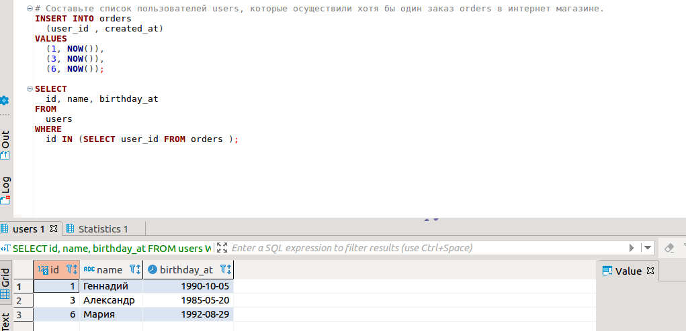
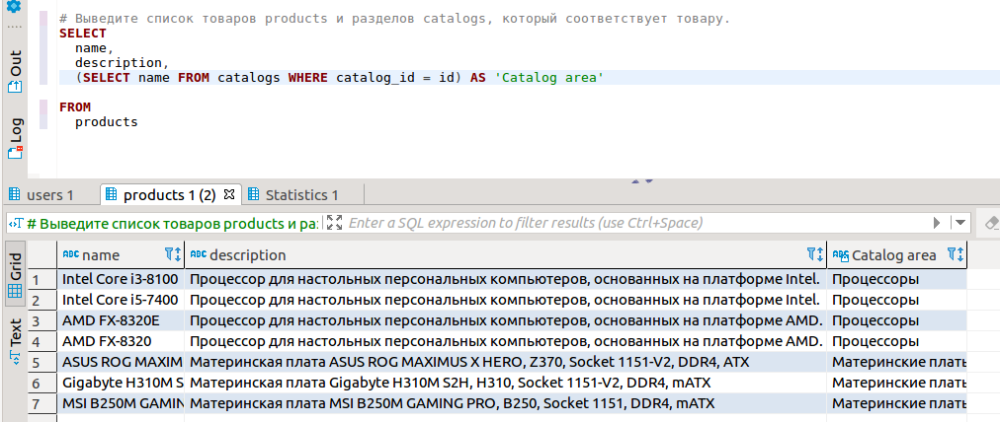
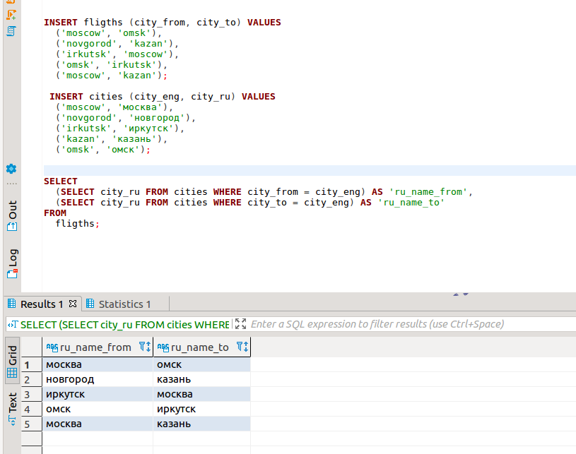

###### Задача №1
Составьте список пользователей users, которые осуществили хотя бы один заказ orders в интернет магазине.

###### Задача №2
Выведите список товаров products и разделов catalogs, который соответствует товару.

###### Задача №3
Пусть имеется таблица рейсов flights (id, from, to) и таблица городов cities (label, name). Поля from, to и label содержат английские названия городов, поле name — русское. Выведите список рейсов flights с русскими названиями городов.

